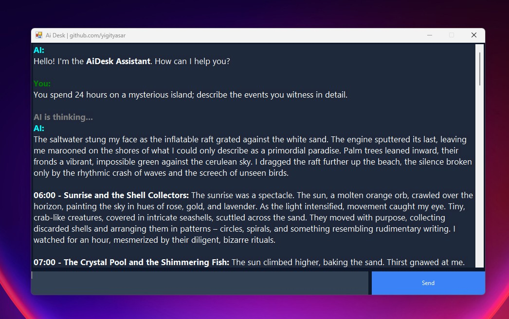
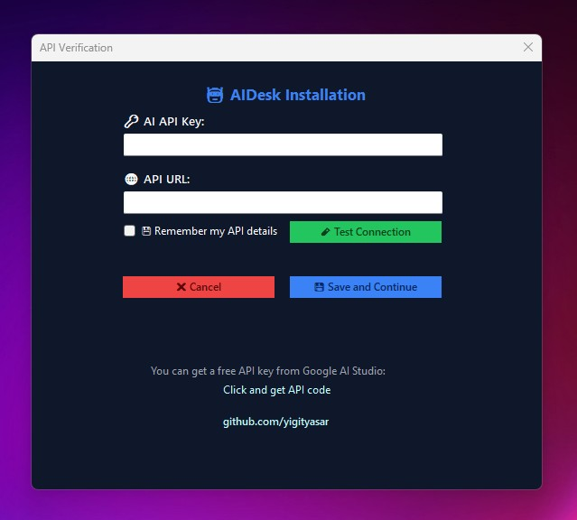

# AiDesk

**AiDesk** is a modern, dark-themed AI assistant client built with **C# Windows Forms**.
Chat directly with the **Ai Studio API** from your desktop. All your settings, including your API key, are securely encrypted and stored locally.

---

## Features
- Real-time chat directly with the Ai Studio API
- Secure API key configuration with encrypted local storage
- Clean, modern UI inspired by VSCode and modern chat apps
- Renders basic Markdown responses like `**bold**` text
- `Ctrl + Enter` shortcut to send messages
- Random welcome prompts on startup to begin the conversation
- Full dark-themed interface

---

## Screenshots
<table align="center">
  <tr>
    <td align="center">
       
      AiDesk | Main Chat UI
    </td>
    <td align="center">
       
      AiDesk | API Configuration
    </td>
  </tr>
</table>

---

## Usage
- On first launch, enter your **Ai Studio API Key** and URL (if needed) in the configuration screen
- Type your prompt into the input box
- Click the **Send** button or press **Ctrl + Enter**

---

## License
This project is licensed under the **MIT License**.
